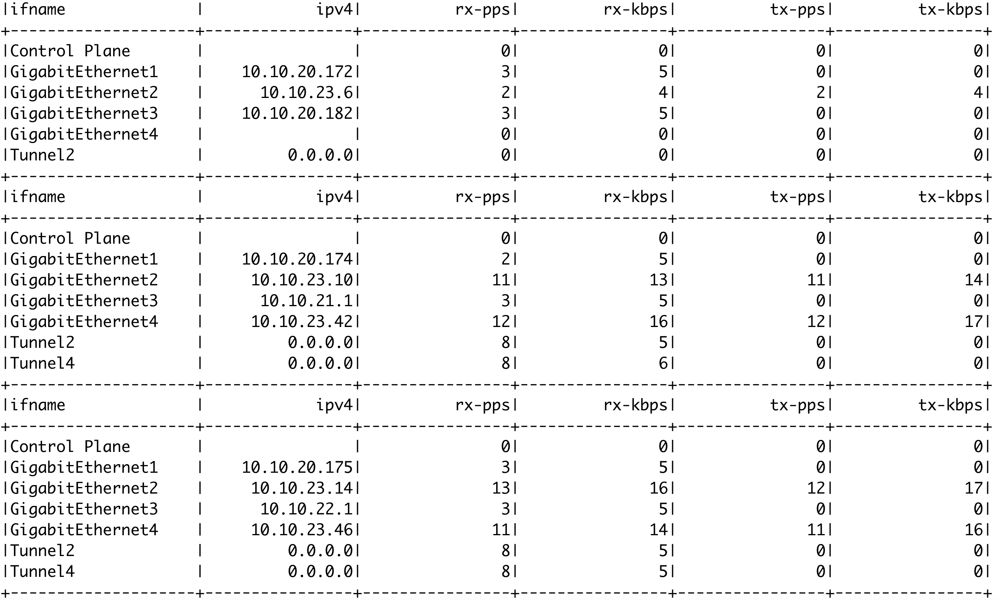

# sdwan_monitor
> An example of python library to query interface status from Cisco vManage.

## Table of contents
* [General info](#general-info)
* [Screenshots](#screenshots)
* [Setup](#setup)
* [Features](#features)
* [Status](#status)
* [Inspiration](#inspiration)
* [Contact](#contact)

## General info
The purpose of this project is to make a REST call to Cisco vManage and show interface throughput statistics.

## Screenshots

## Setup
* This project was tested on python 3.7.6.
* Clone the project
* Create virtual environment: `python -m venv env`
* Activate the virtual environment: `source env/bin/activate`
* Add library requirement: `pip install -r requirements.txt`
* Change the vManage's IP and credentials in `settings/settings_sample.json`
* Rename the `settings/settings_sample.json` to `settings/settings.json`
* Modify the dev_list.json and add the device IP addresses to monitor
* Modify the field_list.json and add the fields you need to show
* Typical fields: ifname, if-index, vpn-id, ipv4, discontinuity-time-date, rx-octets, rx-packets, tx-octets, tx-packets, tx-errors, new-name, in-multicast-pkts, out-multicast-pkts, out-broadcast-pkts, rx-drops, tx-drops, rx-errors, in-unknown-protos, rx-pps, rx-kbps, tx-pps, tx-kbps, lastupdated

## Code Examples
Show examples of usage:
* Run program: `python __main__.py -d <dev_list> -f <field_list> -c <optional csv_file>`
* Program can be packaged using zipapp as follow:\
`python3 -m zipapp -p '/usr/bin/env python3' -o sdwan_monitor.pyz sdwan_monitor`
* Then sdwan_monitor.pyz can be run as a binary file as follow:\
`sdwan_monitor.pyz -d <dev_list> -f <field_list> -c <optional csv_file>`

## Features
List of features ready and TODOs for future development
* Monitor interface's stats based on the supplied field list

To-do list:
* Add interval as an argument

## Status
Project is: _in progress_

## Inspiration
Project inspired by a customer request to monitor device's interfaces and write output to a csv file.\
Thanks README.md template from https://github.com/ritaly/README-cheatsheet

## Contact
Created by [@stantiku(https://github.com/stantiku) - feel free to contact me!
